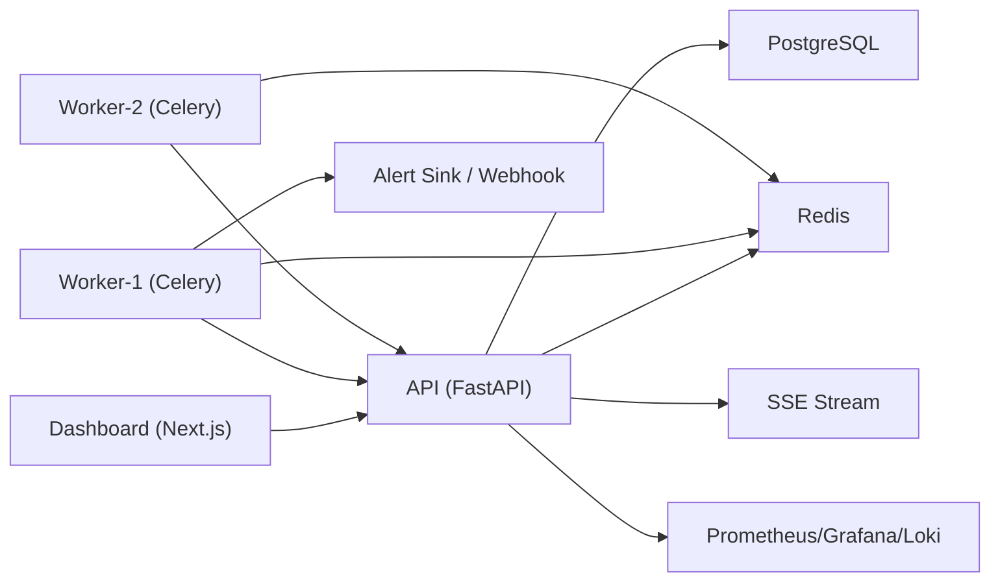

# AgentOps Platform PR 발표 자료 (Phase 3 완료 기준)

## 슬라이드 1. 제목
- 제목: AgentOps Platform 진행 결과 PR
- 부제: 24시간 에이전트 작업 모니터링 플랫폼 (Phase 1~3)
- 발표자: Junlab / Codex 협업
- 날짜: 2026-03-01

## 슬라이드 2. 왜 이 프로젝트를 시작했나
- 항상 켜져 있는 Mac Mini를 에이전트 작업 허브로 활용
- 사람이 없어도 작업이 계속 진행되는 환경 필요
- 작업 상태/실패/병목을 한눈에 볼 운영 대시보드 필요
- 재사용 가능한 프로젝트 템플릿화 목표

## 슬라이드 3. 문제 정의
- 기존: CLI 중심 실행으로 상태 추적이 단편적
- 리스크:
  - 실패를 늦게 발견
  - 재시도/원인 분석 비용 증가
  - 여러 프로젝트 동시 운영 시 가시성 부족
- 요구사항:
  - 실시간 모니터링
  - 실행 이력/로그 보존
  - 정책 기반 자동 제어

## 슬라이드 4. 목표와 범위
- 목표:
  - 에이전트 작업의 생성-실행-관찰-제어를 단일 플랫폼화
- 이번 PR 범위(완료):
  - Phase 1: 기본 실행/로그/실시간 갱신
  - Phase 2: 템플릿 레지스트리/버전 관리/검색·분석
  - Phase 3: 스케줄러/정책 엔진/에이전트 상태/멀티워커

## 슬라이드 5. 전체 아키텍처
- API: FastAPI + PostgreSQL + Redis
- Worker: Celery 기반 비동기 작업 실행
- Dashboard: Next.js
- Observability: Prometheus + Grafana + Loki
- Alert Sink: 웹훅 검증용 수신기

## 슬라이드 6. Phase 1 성과
- 작업 생성/조회/재시도 API
- 실행 로그 자동 적재(`task_logs`)
- SSE 기반 실시간 화면 반영
- 실패/재시도 웹훅 경로 검증
- E2E: `make test-e2e` 통과

## 슬라이드 7. Phase 2 성과
- 템플릿 레지스트리 + 버전 관리
- 기본 버전/명시 버전 실행 지원
- 실행 검색(`/v1/search/runs`) 및 버전 분석 API
- Dashboard: 템플릿/검색/비교 화면 제공
- E2E: `make test-e2e-phase2` 통과

## 슬라이드 8. Phase 3 성과 (핵심)
- 스케줄 관리:
  - 생성/수정/일시정지/재개/즉시실행
  - 예약 실행 이력(`schedule_runs`)
- 정책 엔진:
  - 지표 조건 평가 후 자동 액션 실행
  - 액션 기록(`policy_actions`)
- 에이전트 관리:
  - heartbeat 수집/상태 추론(online/degraded/offline)
- 멀티워커:
  - `worker-2` 프로파일 추가
  - 분산 수신 로그 확인

## 슬라이드 9. 운영 관점 개선점
- 장애 감지 속도 향상:
  - 상태, 로그, 실행 이력의 단일 조회 경로 확보
- 반복 작업 자동화:
  - 스케줄 + 정책으로 수동 개입 감소
- 확장성:
  - 단일 워커에서 멀티워커로 확장 가능한 구조 검증
- 표준화:
  - 각 Phase 문서 세트/런북/세션 로그 정착

## 슬라이드 10. 품질/검증 결과
- 통합 검증:
  - `make test-e2e` PASS
  - `make test-e2e-phase2` PASS
  - `make test-e2e-phase3` PASS
- 실운영성 검증:
  - API/대시보드/워커/모니터링 스택 Docker 기동 확인
  - 멀티워커 heartbeat 2노드 확인
- 이슈 대응:
  - worker 들여쓰기 오류 1건 수정
  - 정책 schedule-scope SQL 버그 1건 수정 후 재검증

## 슬라이드 11. 데모 시나리오 (5분)
- 1) 대시보드 접속 후 프로젝트 전반 상태 확인
- 2) 스케줄 1개 생성 (`every:20`)
- 3) `run-now` 실행 → run 이력 생성 확인
- 4) 정책 생성(임계치 0%) → 자동 pause 액션 확인
- 5) `/agents`에서 worker-1/worker-2 heartbeat 확인
- 6) E2E 명령 1줄 실행으로 재현성 확인

## 슬라이드 12. PR 변경 요약
- 코드:
  - API/Worker/Dashboard/Compose 업데이트
- 테스트:
  - Phase3 E2E 스크립트 신설
- 문서:
  - PRD/Phase3 명세/런북/세션·워크 로그 반영
- 커밋 단위:
  - `feat(phase3)` / `test(phase3)` / `docs(phase3)`

## 슬라이드 13. 제한사항(현재)
- 정책 액션 일부는 MVP 수준(no-op 포함)
- 인증/권한/멀티테넌시는 아직 미구현
- 외부 공개(도메인/HTTPS/배포 자동화) 미완료
- 고부하/장시간 soak test는 다음 단계 과제

## 슬라이드 14. 다음 단계 제안 (Phase 4)
- 인증/권한(RBAC) 추가
- 외부 접근 배포 체계(HTTPS, reverse proxy, 백업)
- 알림 채널 확장(Slack/Telegram/PagerDuty)
- 외부 AI 에이전트 이벤트 표준 수집(Claude 포함)
- SLO 기반 운영 지표 대시보드 강화

## 슬라이드 15. 요청사항
- 승인 요청:
  - Phase 3 결과를 기준선(main)으로 운영 시범 적용
- 의사결정 필요:
  - Phase 4 우선순위: 보안 vs 배포 vs 알림
- 리소스:
  - 외부 공개를 위한 도메인/인증서/네트워크 정책

## 부록 A. 발표 시 한 줄 메시지
- "이제 이 플랫폼은 작업 실행 여부를 보는 수준을 넘어, 자동 실행과 자동 제어가 가능한 운영 도구 단계로 올라왔습니다."

## 부록 B. 참고 문서
- PRD: `docs/PRD_AgentOps_v2_ko.md`
- Phase3 계획: `docs/Phase3_Plan_ko.md`
- 운영 런북: `docs/runbook.md`
- 세션 로그: `docs/SESSION_LOG.md`
- 회고 로그: `docs/WORK_LOG.md`
